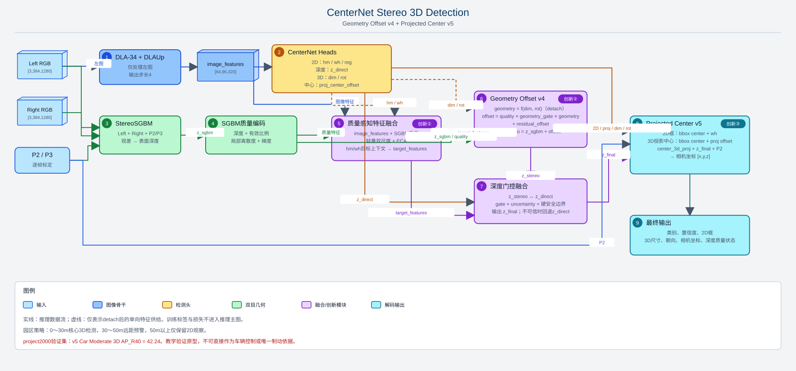

# 面向园区低速车的质量感知双目 CenterNet 三维检测网络

## 摘要

本文档以论文“方法”章节的形式说明本项目当前已验证的网络主线：**Geometry Offset v4 + Projected Center v5**。系统以KITTI左右彩色图和逐帧标定矩阵为输入，在CenterNet单阶段检测框架中融合StereoSGBM几何深度，输出二维检测、三维尺寸、朝向和相机坐标位置。

与仅预测单目深度的直接回归路线相比，本方案不把SGBM当作绝对可靠的真值，也不直接把视差深度等同于物体三维中心深度。它先显式描述SGBM通常观测到“可见表面”的事实，再由质量门控、几何先验和学习残差共同恢复三维中心深度；最后通过独立的三维中心投影头，解决二维检测框中心与三维几何中心投影不一致的问题。



## 1. 问题定义与输入输出

给定同一时刻左、右相机图像 `I_L`、`I_R`，以及该帧的投影矩阵 `P2`、`P3`，网络对每个目标预测：

```text
类别、置信度、二维框、三维尺寸[h,w,l]、朝向rotation_y、相机坐标[x,y,z]
```

其中，`P2/P3` 是车载双目相机的逐帧几何标定。它们是数据采集时标定得到的传感器几何关系，不是由标签、点云或模型在推理阶段预测出来的。训练真值只用于构造损失，实际推理不读取KITTI `label_2`。

项目将 `0～30m` 设为园区低速车的核心三维检测范围；`30～50m` 用于远距预警和跟踪准备；超过 `50m` 的目标仅保留二维观察，不以双目三维结果作为可靠依据。

## 2. 整体网络

### 2.1 共享图像特征与基础检测头

左图进入 `DLA-34 + DLAUp + IDAUp`，得到大小为 `[B,64,96,320]` 的共享特征。该尺度对应原图 `384×1280` 的四分之一分辨率。基础CenterNet头在同一特征图上预测：

- `hm / wh / reg`：目标中心热图、二维宽高与亚像素偏移；
- `dep`：不依赖双目的网络直接深度 `z_direct`；
- `dim / rot`：三维尺寸与MultiBin朝向；
- `proj_center_offset`：二维框中心到三维几何中心投影点的偏移。

共享骨干使二维检测与三维属性使用同一目标外观特征，但后续的双目几何分支保持独立，便于解释其何时可信、何时应被抑制。

### 2.2 SGBM几何分支

`I_L` 与 `I_R` 经StereoSGBM得到视差和表面深度 `z_sgbm`。除深度本身外，分支还编码局部有效视差比例、深度离散度和深度梯度。这样网络不只看到“测得多远”，也能识别纹理不足、遮挡、反光或边缘区域中SGBM是否不可信。

## 3. 三项核心创新

### 创新一：质量感知的双目—网络深度融合

传统做法常把双目深度直接作为最终距离，或把单目回归深度完全替代双目几何。本文使用两种候选深度：

```text
z_direct：图像特征直接回归的深度
z_stereo：SGBM表面深度经过offset修正后的中心深度
```

融合模块将图像特征、SGBM深度和质量编码送入轻量双尺度融合与ECA通道注意力，并预测 `depth_gate`：

```text
z_final = gate × z_stereo + (1 - gate) × z_direct
```

训练期以哪一种候选深度更接近真值来监督 `gate`，并采用Focal调制和误差差值权重，使模型重点学习“该信任谁”的困难样本。推理期不使用真值，同时保留硬安全边界：视差无效、质量不足、offset越界、远距不确定性过大时，强制 `gate=0` 并回退到 `z_direct`。

这个设计的创新不在于简单增加一个融合层，而在于同时保留了：**双目几何的可解释性、网络回归的鲁棒性、质量估计与可执行的安全回退路径**。

### 创新二：面向可见表面深度的 Geometry Offset

SGBM在车辆框内得到的深度往往属于车头、车侧或车窗等可见表面，而KITTI三维标签的 `z` 对应三维框中心。两者存在系统性偏移，且偏移随车辆尺寸和观察角改变。本文将该差异显式拆分为几何先验与学习残差：

```text
geometry_offset = 0.5 × (length × |cos(alpha)| + width × |sin(alpha)|)

depth_offset = quality × learned_geometry_gate × geometry_offset
             + learned_residual_offset
```

其中 `alpha` 为观察角。几何项提供“可解释的初始表面—中心距离”，质量与可学习门控决定它是否可用，残差项修正遮挡、背景混入及SGBM采样误差。

尺寸头与朝向头在这条计算路径上使用 `detach()`：它们可为几何先验提供信息，但offset损失不会反向改变尺寸和朝向预测。这确保几何耦合不会破坏已有三维属性头的稳定性。

### 创新三：二维框中心与三维中心投影解耦

二维框中心是可见像素区域的中心，而三维框中心投影点受透视、遮挡与截断影响，二者通常不重合。若直接用二维框中心反投影三维位置，会把二维定位偏差放大到相机坐标 `x/y`。

本文保留原CenterNet二维检测中心，同时新增两通道投影偏移头：

```text
center_2d = bbox_center
center_3d_proj = bbox_center + proj_center_offset

bbox = center_2d + wh
[x, y, z] = unproject(center_3d_proj, z_final, P2)
```

训练真值由KITTI三维框几何中心投影得到：

```text
center_3d = [x, y - height / 2, z]
center_3d_proj = project(P2, center_3d)
target_offset = center_3d_proj - bbox_center
```

这使二维检测与三维定位使用各自正确的中心定义。极端边缘车辆的投影偏移在训练和推理中采用同一上限，避免少数画外目标主导梯度。

## 4. 训练目标与推理边界

总训练损失由二维检测、直接深度、三维尺寸、朝向、深度offset、深度融合门控和投影中心偏移构成。距离权重为 `0～15m: 2.0`、`15～30m: 1.5`、`30～50m: 0.5`、`50m以上: 0.0`，使训练目标与园区低速车的近距风险优先级一致。

推理阶段只使用左右图和对应 `P2/P3` 标定，不读取三维标签、点云或真值深度。输出包含类别、二维框、三维尺寸、朝向、相机坐标、深度来源和质量信息；当深度质量无效时必须明确标记回退状态。

## 5. 实验结论与消融边界

在固定 `project2000` 划分（1600帧训练、400帧验证）上，已验证主线的Car Moderate指标为：

| 版本 | 关键改动 | BEV AP_R40 | 3D AP_R40 | 结论 |
|---|---|---:|---:|---|
| Geometry Offset v4 | 质量门控几何offset + 残差 | 43.44 | 30.36 | 验证几何表面—中心建模有效 |
| Projected Center v5 | 2D/3D中心解耦 | 45.87 | 42.24 | 当前主线与最佳权重 |
| Projected Center v6a | 增加相机XY一致性损失 | 45.85 | 42.29 | 变化接近波动，不替代v5 |
| Projected Center v7 | 尺度归一化重叠代理 | 45.86 | 41.99 | 未优于v5 |
| Dimension v6b | 只训练尺寸头 + 相对Smooth L1 | 45.75 | 42.18 | 未优于v5 |

误差反事实分析表明，若把某一项单独替换为真值，平均三维IoU的潜在增益约为：深度 `+0.116`、投影中心XY `+0.046`、朝向 `+0.019`、尺寸 `+0.010`。因此后续优化应优先解决深度与投影中心长尾问题，而不是继续单独放大尺寸损失。

## 6. 复现实验入口

- 模型定义：`src/lib/models/networks/stereo_pose_dla_dcn.py`
- 深度融合与几何offset：`src/lib/models/networks/stereo_depth_offset.py`
- 联合损失：`src/lib/trains/stereo_ddd.py`
- v4正式训练：`experiments/stereo_ddd_project2000.sh`
- v5投影中心训练：`experiments/stereo_ddd_projected_center_v5.sh`
- 误差分析：`src/tools/analyze_stereo_errors.py`

本项目是教学与离线验证案例。未经园区实车标定、时延测试、场景覆盖和安全冗余验证，输出不可作为车辆控制或唯一制动依据。
