# 项目版本架构图

本目录按项目主线版本保存SVG架构图。建议初学者先看“演进总览”，再按编号依次阅读。

## 阅读标准

- 箭头表示数据或特征流动方向；
- 红色虚线表示真值监督，只在训练阶段存在；`detach`表示对应路径禁止梯度回传；
- 灰色模块表示继承但冻结，不参与当前版本参数更新；
- 每张图底部的“初学者一句话”说明该版本最重要的变化；
- 蓝色是输入，橙色是神经网络，绿色是传统几何，紫色是融合，青色是输出，红色是损失。

## 版本列表

| 顺序 | 版本 | 主要变化 | 状态 |
|---:|---|---|---|
| 0 | 演进总览 | 展示主线和未采用的消融旁支 | 已完成 |
| 1 | 阶段1 | CenterNet 2D检测 + SGBM双目测距 | 已完成 |
| 2 | Stereo DDD基线 | 增加3D属性头和SGBM深度offset | 已完成 |
| 3 | Fusion Gate v2 | 双尺度、质量编码、目标上下文和学习gate | 已完成 |
| 4 | Campus Gate v3 | 园区距离分层与代价加权Focal gate | 已完成 |
| 5 | Geometry Offset v4 | 尺寸/朝向几何先验 + 学习残差 | 已完成并评估 |
| 6 | Projected Center v5 | 分离2D框中心和3D中心投影点 | 已完成并评估 |
| 7 | Projected Center v6a | 增加相机XY一致性损失 | 已评估，未显著优于v5 |
| 8 | Projected Center v7 | 尺度归一化中心重叠代理损失 | 已评估，未优于v5 |
| 9 | Dimension v6b | 只训练尺寸头 + 相对尺寸Smooth L1 | 已评估，未优于v5 |
| 10 | 论文主线框架 | v4几何深度融合 + v5投影中心解耦 | 当前已验证主线 |
| 11 | YOLOv8风格总览 | Backbone/Heads/SGBM/Fusion总览，参考YOLOv8架构图风格 | 已完成 |

## 0. 演进总览

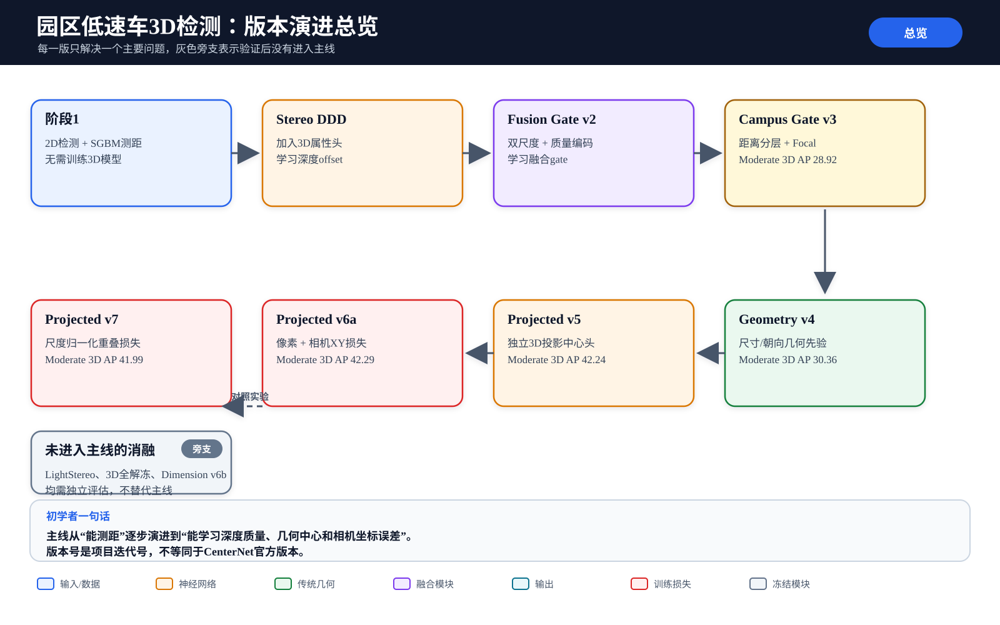

## 1. 阶段1：CenterNet + SGBM

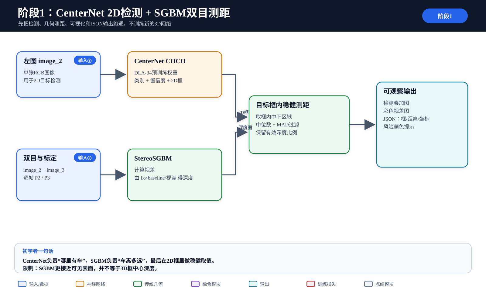

## 2. Stereo DDD基线

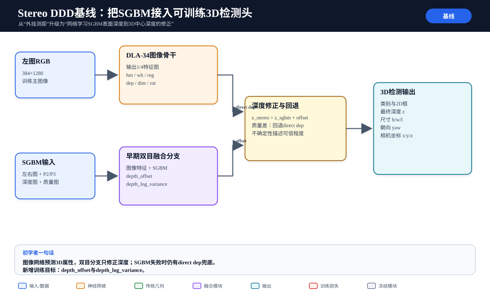

## 3. Fusion Gate v2

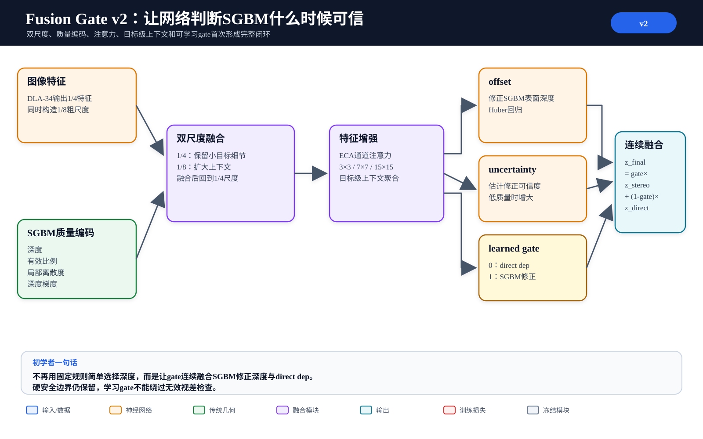

## 4. Campus Gate v3

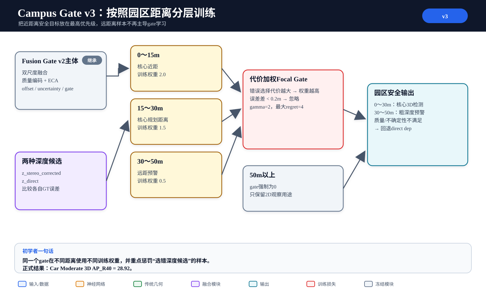

## 5. Geometry Offset v4

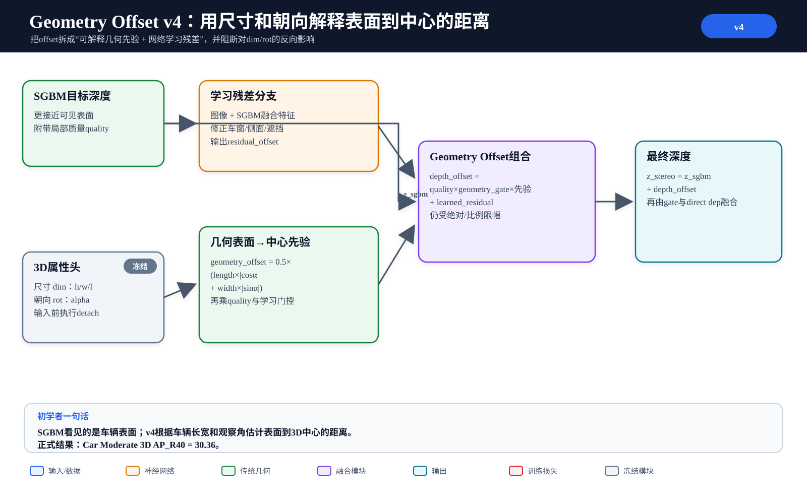

## 6. Projected Center v5

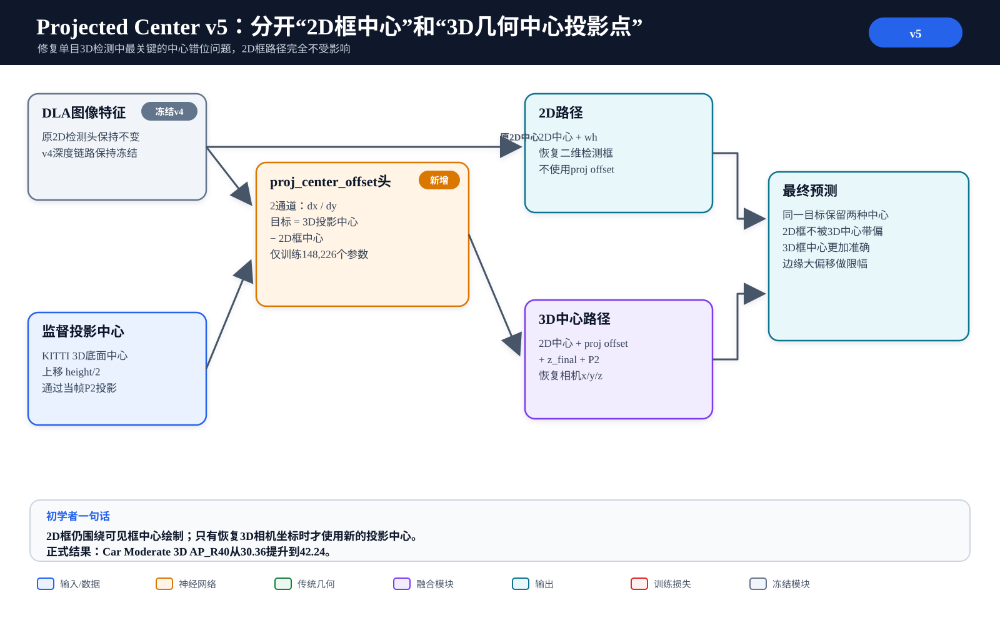

## 7. Projected Center v6a

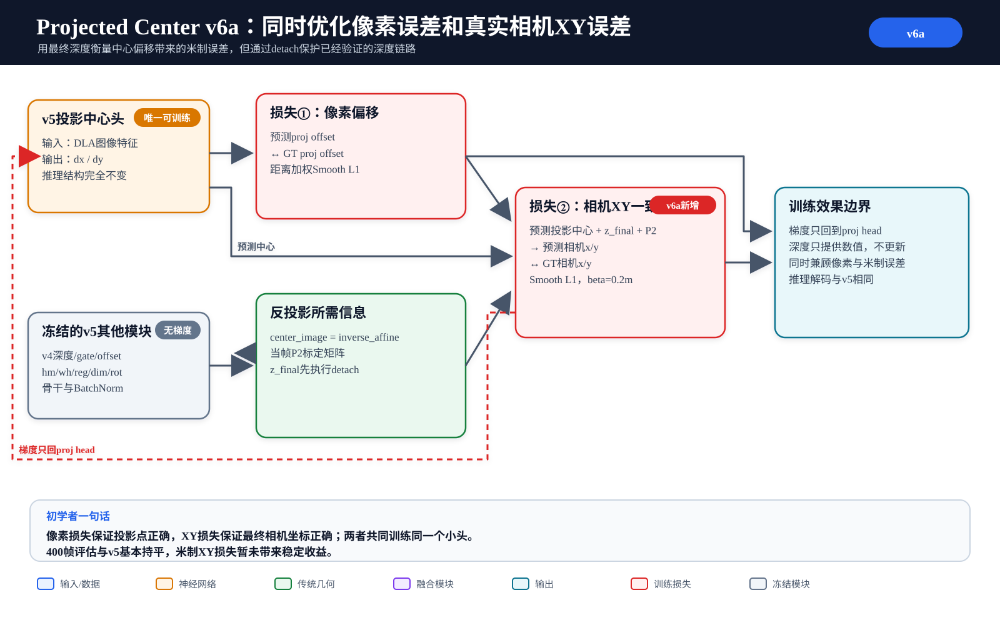

## 8. Projected Center v7

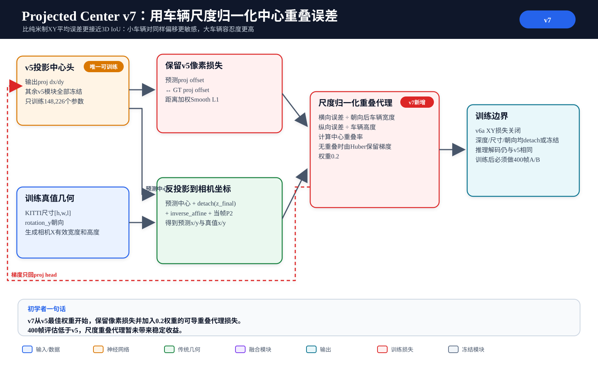

## 9. Dimension v6b

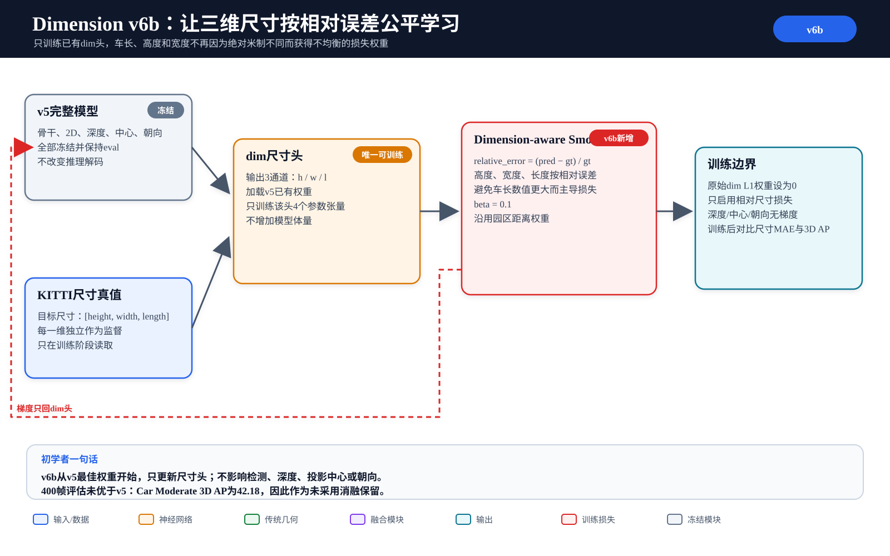

## 10. 论文主线网络框架

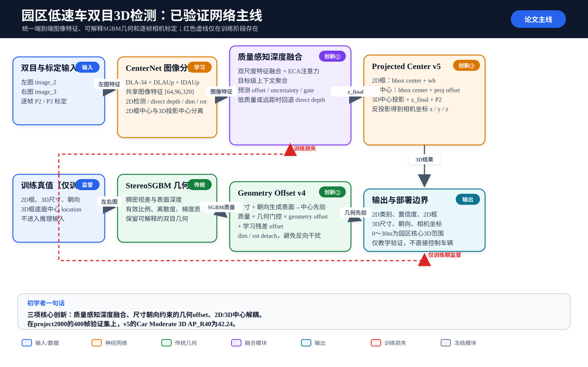

## 11. YOLOv8风格总览框架图

参考YOLOv8网络架构图风格，包含DLA-34骨干、CenterNet检测头、并行SGBM几何分支、质量感知特征融合、Geometry Offset v4、Depth Fusion Gate和Projected Center v5反投影解码。图中保留`z_direct`、`z_sgbm`、`quality`、`target_features`和投影中心输入的独立连线，便于复核真实数据流。


## 重新生成

架构图由Python标准库生成，不需要安装额外绘图库：

```bash
# 生成0~10号版本演进架构图
python src/tools/generate_architecture_svgs.py

# 生成11号YOLOv8风格总览框架图
python src/tools/generate_yolov8_style_architecture.py
```

修改架构图时应同时更新生成脚本，避免手工SVG和项目结构说明长期不一致。
